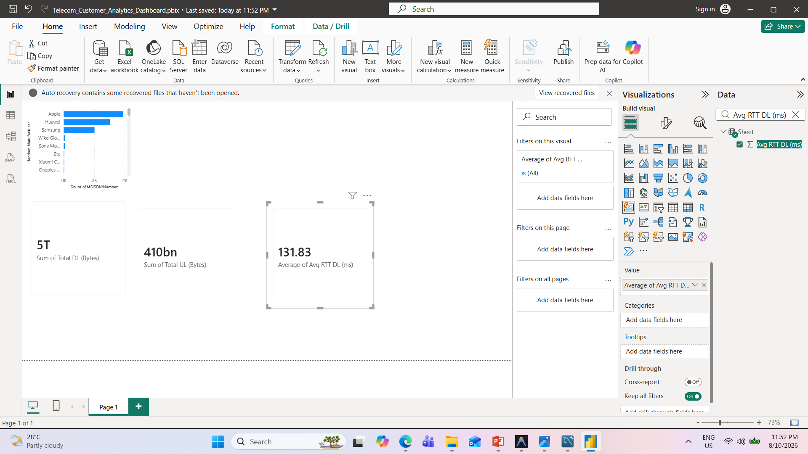

# Telecom Customer Analytics Project

## Project Overview

This project analyzes telecom customer behavior to understand user engagement, network experience, application usage, and customer satisfaction.

The project includes data cleaning, exploratory data analysis, clustering, satisfaction scoring, regression modeling, SQL analysis, MySQL integration, and a Power BI dashboard.

## Tools and Technologies

- Python
- Pandas
- NumPy
- Matplotlib
- Seaborn
- Scikit-learn
- PCA
- K-Means Clustering
- Linear Regression
- SQL
- MySQL
- Power BI
- GitHub

## Project Tasks

### 1. User Overview Analysis
- Handset analysis
- Manufacturer analysis
- Application usage analysis
- Missing value and outlier handling
- Correlation analysis
- PCA dimensionality reduction

### 2. User Engagement Analysis
- Session frequency
- Session duration
- Total traffic
- K-Means clustering
- Elbow method
- Top users by application

### 3. User Experience Analysis
- TCP retransmission
- RTT analysis
- Throughput analysis
- Handset-based network analysis
- Experience clustering using K-Means

### 4. Customer Satisfaction Analysis
- Engagement score
- Experience score
- Satisfaction score
- Top satisfied customers
- Linear Regression model
- K-Means satisfaction clustering
- Model tracking
- Satisfaction score export to MySQL

## SQL Analysis

SQL was used to analyze:

- Customer usage patterns
- High, Medium, and Low usage groups
- Application traffic
- Handset manufacturers and models
- RTT
- TCP retransmission
- Customer data consumption

## Power BI Dashboard

The Power BI dashboard provides a visual summary of:

- Top handset manufacturers
- Total download traffic
- Total upload traffic
- Average download RTT

## Model Tracking

The satisfaction regression model was tracked using:

- Model version
- Start and end time
- Model parameters
- MAE
- MSE
- RMSE
- R² Score
- Saved model artifact

## Key Business Insights

- Apple, Huawei, and Samsung are the major handset manufacturers.
- Gaming generates the highest application traffic.
- Download traffic is significantly higher than upload traffic.
- Network performance varies across customer usage groups.
- Customer segmentation can support targeted retention and service improvement strategies.

## Repository Files

- `TELECOM.ipynb` - Main Python analysis
- `Telecom_SQL_Analysis.ipynb` - SQL analysis documentation
- `telcom.sql` - SQL queries
- `Telecom_Customer_Analytics_Dashboard.pbix` - Power BI dashboard
- `image.png` - Dashboard screenshot
- `telecom_satisfaction_scores.csv` - Final satisfaction scores
- `model_tracking.csv` - Model tracking information
- `satisfaction_model_v1.pkl` - Saved regression model
- `telecom_data_sample.xlsx` - Telecom dataset

## Conclusion

The project demonstrates an end-to-end telecom customer analytics workflow combining Python, machine learning, SQL, MySQL, and Power BI to generate actionable customer and network insights.
